# Modelling microbial processes using a bioenergetic approach #

[Bajracharya et al. (2022)][5] have published a brilliant paper describing a method to calculate microbial catabolism, anabolism, dormancy and maintenance (including decay). The method is here implemented using the [Phreeqc][6] code by [Parkhurst and Appelo (2013)][7]. The model is available in the [releases section][8].

## Background ##

The stoichiometry of the _catabolic_ and _anabolic_ reactions for a microbial process can be established by element and charge balancing. From the stoichiometry, Gibbs energy changes can be calculated for each of these two processes ([Heijnen and Kleerebezem, 2010][1]; [Smeaton and Van Cappellen, 2018][2]). The overall growth reaction (the metabolic reaction), however, can not be determined unless the growth yield, _Y_, is experimentally established or unless it is estimated. Once the overall growth reaction is known, ΔGmet, the Gibbs energy change for the overall metabolic reaction, can be calculated. See Examples 7, 8 and 19 in [(Heijnen and Kleerebezem, 2010)][1]. The information for **only one** of the three characteristics of the metabolic process is required: (1) growth yield, (2) ΔGmet, or (3) the stoichiometry of the overall growth reaction; the other two can then be derived.

Both biomass decay and maintenance energy result in a decrease of the observed growth yield at low anabolic rates: when the microbial growth is slow, a larger proportion of the substrate is used for cell maintenance [(Calabrese et al., 2021)][3]. Thus, both the stoichiometry and the dissipation energy for the metabolic process vary with the reaction rate, see Example 15 in [(Heijnen and Kleerebezem, 2010)][1].

Having a method to estimate values of either the ΔGmet, or the growth yield, _Y_, is fundamental in order to model microbial systems that can not be studied experimentally. As noted above, these values are related to each other, so only one of them is needed to establish the other, and to obtain the overall stoichiometry of the metabolic reaction.

But instead of estimating either _Y_ (the growth yield) or ΔGmet, the microbial system can be modeled if the rates of catabolism, anabolism, dormancy and maintenance (including decay) are calculated as a function of the changing chemical environment. This results in a calculated overall growth rate, which in turn allows the calculation of growth yields, ΔGmet, and the overall stoichiometry of the metabolic process(es). This method is used in ([Vallino and Huber, 2018][4]; [Bajracharya et al., 2022][5]).

## The model of Bajracharya et al. (2022) ##

[Bajracharya et al. (2022)][5] apply their elegant method to model several, simultaneous, coupled microbial processes:

1. the degradation of organic matter (cellulose) to
   smaller organic molecules (glucose),
2. the fermentation of glucose to acetate and
   dihydrogen (H2(aq)), and
3. sulfate reduction using either acetate
   or H2 as electron donors.

Two groups or microbes are involved in this model: **CFB** and **SRB**, cellulose fermenting bacteria and sulfate reducing bacteria, respectively. To achieve cellulose degradation extra cellular hydrolytic enzimes, **HE**, are produced by the CFB. The stoichiometry for the catabolic processes (1) and (2) are provided in eqns.(18) to (20) by [Bajracharya et al. (2022)][5].

### Missing information ###

The stoichiometry of the anabolic reactions (microbial growth) are not specified in [Bajracharya et al. (2022)][5].

For the growth of CFB on glucose, the [Phreeqc model][8] uses the following stoichiometry:

    0.175 C6H12O6 + 0.2 NH4+ = CH1.8O0.5N0.2 + 0.05 H2CO3 + 0.4 H2O + 0.2 H+

from [Smeaton and Van Cappellen (2018)][2], Table B.1, cross-referemce nr (CR) 95 in their supplementary material.

Some SRB grow on acetate, while some other SRB use H2 and CO2+acetate. From eqns.(21) and (22) in [Bajracharya et al. (2022)][5] it is possible to infer that in their model SRB growth is based solely on acetate, although this is not explicitly mentioned in the paper. The stoichiometry of the reaction for SRB growth on acetate is not specified in [Bajracharya et al. (2022)][5], and the [Phreeqc model][8] model presented here uses:

    0.525 CH3COO- + 0.2 NH4+ +0.275 H+ = CH1.8O0.5N0.2 + 0.05 HCO3- + 0.4 H2O

from [Smeaton and Van Cappellen (2018)][2], Table B.1, cross-referemce nr (CR) 76 in their supplementary material.

The initial concentration of the extracellular hydrolytic enzymes (HE) is not given in Table 2 of [Bajracharya et al. (2022)][5], and the value of 10-5 read in Fig.2A is used in the [Phreeqc model][6].

### Possibly erroneous parameters ###

Some of the values in Table 2 are clearly erroneous, for example the standard Gibbs energies for sulfate respiration both with dihydrogen and acetate do not agree with the data from the NBS tables [(Wagman et al., 1982)] [9] and they also disagree with the values listed in the supplementary material in [(Smeaton and Van Cappellen, 2018)][2].

A comparison of the biochemical standard Gibbs energy values given in Table 2 of [Bajracharya et al. (2022)][5] with the standard state Gibbs energies, in the same table, indicates differences that do not seem to be consistent with the provided stoichiometry in their eqns.(18) to (20).

This uncertainty in the reaction stoichiometries is problematic if a replication is attempted of the model presented in [Bajracharya et al. (2022)][5]. The microbial energy balance is calculated using Gibbs energies of reaction, ΔGr, adjusted with their eqn.(4) for changes in chemmical composition using _Q_, the reaction quotient.  Wrong stoichiometries will lead to wrong values of _Q_, yielding wrong ΔGr values and possibly also wrong reaction rates, because _Q_ is also used in eqn.(2) of the paper.

The Gibbs energy values, ΔGr, are fundamental to the model, and for the Phreeqc calculations presented here the following strategy is used: the values for the Gibbs energies at the initial concentrations listed in Table 2 are assumed to be correct, as well as the stoichiometries in eqns.(18) to (20). The initial values of log(_Q_) are calculated, and the following relationship is used:

   ΔG°r = ΔGr,ini - R T ln(10) log(_Q_)

these standard state Gibbs energies at 10° are then used in the [Phreeqc model][8] together with calculated values of _Q_ and eqn.(4) in the paper. The values calculated in this manner of the standard Gibbs energies at 10° are:

- For sulfate respiration with H2:

   ΔGr,ini = -8.96 kJ/mol  (Table 2)  
   log(_Q_) = 10.541  (Phreeqc)  
   ΔG°r = -66.10 kJ/mol  (calculated)

- For sulfate respiration with acetate:

   ΔGr,ini = -24.61 kJ/mol  (Table 2)  
   log(_Q_) = -0.237  (Phreeqc)  
   ΔG°r = -23.33 kJ/mol  (calculated)

- For cellulose fermentation to acetate and H2:

   ΔGr,ini = -68.97 kJ/mol  (Table 2)  
   log(_Q_) = -11.975  (Phreeqc)  
   ΔG°r = -4.06 kJ/mol  (calculated)

### The database ###

The Phreeqc database used in is included in the the [release][8]. It is based on `wateq4f.dat` distributed with [Phreeqc][6] version 3.7.3. In this database the redox link between the following redox couples has been disabled:

1. sulfate and sulfide,
2. carbonate and methane
3. N2 with the rest of nitrogen valences (ammonia and nitrate)

without this "un-linking", sulfate would be unrealistically, and inmediately, reduced to sulfide by dissolved molecular hydrogen, without the mediation of SRB.

### Compparison of results ###

The Phreeqc model in the [releases section][8] is used to simulate the initial non-steady state phase of the baseline calculation reported by [Bajracharya et al. (2022)][5]. The results in the paper are presented in their Figures 2, 3 and 4, as well as in Figures S2 and S3 of their supplementary material.

The following graphs show first each of the original figures followed by the corresponding Phreeqc results.

### Figure S2 ###
#### Fig.S2A - Original: ####
Simulated aqueous concentrations in the baseline simulation: (A) electron-donors and hydrolytic enzymes. All concentrations are in moles carbon per unit water volume, except dihydrogen, which is in moles H2 per unit water volume. The inset figure shows the results for the first 20 days of simulation. From [Bajracharya et al. (2022)][5].

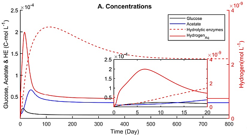  

#### Fig.S2A - Phreeqc results: ####
While the simulated results for HE, glucose and acetate agree quite well with the original model, the results for H2 are several orders of magnitude different.

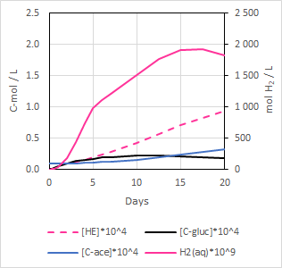 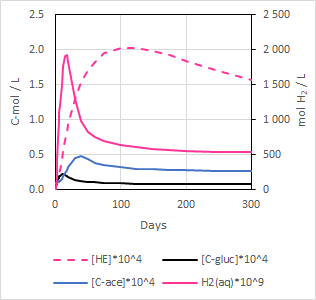

#### Fig.S2B - Original: ####
Simulated biomasses in the baseline simulation: (B) active and dormant bacteria. All concentrations are in moles carbon per unit water volume. The inset figure shows the results for the first 20 days of simulation. From [Bajracharya et al. (2022)][5].

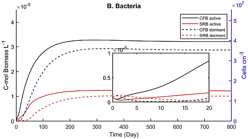  

#### Fig.S2B - Phreeqc results: ####
The simulated results (biomasses) agree quite well with the original model.

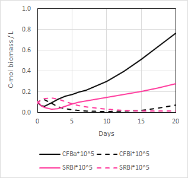 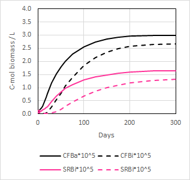

------

### Figure S3 ###
#### Fig.S3A - Original: ####
Times series of energy generation and consumption per unit biomass carbon in the baseline simulation: (A) cellulolytic fermenting bacteria (CFB). The plots show the total energy generated by CFB (TECFB), the energy consumed by growth (GCFB), the energy invested in production of extracellular hydrolytic enzymes (EHE), and the specific growth rate of CRB (µCRB). The horizontal line indicates the  maintenance  energy requirement of the bacteria (MECFB). The inset figure shows the results for the first 20 days of simulation. From [Bajracharya et al. (2022)][5].

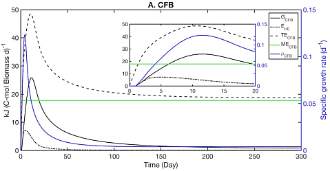  

#### Fig.S3A - Phreeqc results: ####
There seems to be an **error** in the original figure: while in the inset diagram the values of TECFB have a maximum at approsimately 11 days, simultaneously with the peak for the specific growth rate, in the larger plot there is a shift, and the time for the maximum value of the total energy does not correspond to the time for the maximum specific growth rate anymore.

Apart from that, the simulated results with Phreeqc agree quite well with the original model.

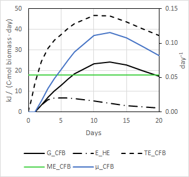 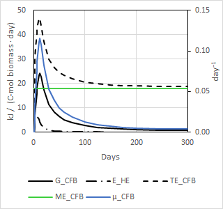

#### Fig.S3B - Original: ####
Times series of energy generation and consumption per unit biomass carbon in the baseline simulation: (B) sulfate-reducing bacteria (SRB). The plots show the total energy generated by SRB (TESRB), the energy consumed by growth (GSRB), and the specific growth rate of SRB (µSRB). The horizontal line indicates the maintenance energy requirement of the bacteria (MESRB). The inset figure shows the results for the first 20 days of simulation. From [Bajracharya et al. (2022)][5].

The sudden peak for the specific SRB growth rate in the original plot is quite surprising, and it does not correspond to the gradual increase in energy consumed by growth. This suggests some kind of **error** in the plot.

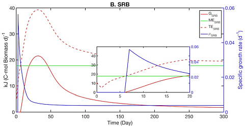  

#### Fig.S3B - Phreeqc results: ####

Apart from the specific growth rate, which might erroneous in the original figure, the simulated results with Phreeqc agree quite well with the original model.

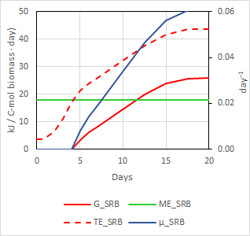 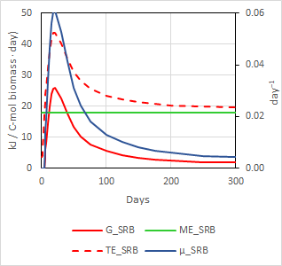

## Conclusions ##

- The bioenergetic approach to model coupled microbial processes, as described in [Bajracharya et al. (2022)][5] can be used with [Phreeqc][6].
- The model if freely available from the [releases section][8].
- There are some (minor?) discrepancies with the original publication [(Bajracharya et al., 2022)][5], hopefully the authors will make their model publicly available in the future.

## See also ##

https://sites.google.com/view/groundwatergeochemistry

References
----------
* Heijnen, J.J., Kleerebezem, R. (2010). Bioenergetics of microbial growth, in: Flickinger, M.C. (ed.) _Encyclopedia of Industrial Biotechnology: Bioprocess, Bioseparation and Cell Technology_. John Wiley & Sons, Inc., Hoboken, NJ, USA, p. eib084. [doi:10.1002/9780470054581.eib084][1]
* Smeaton, C.M., Van Cappellen, P. (2018). Gibbs Energy Dynamic Yield Method (GEDYM): Predicting microbial growth yields under energy-limiting conditions. _Geochimica et Cosmochimica Acta_ **241,** 1–16. [doi:10.1016/j.gca.2018.08.023
][2]
* Calabrese, S., Chakrawal, A., Manzoni, S., Van Cappellen, P. (2021). Energetic scaling in microb [Smeaton and Van Cappellen, 2018][2],ial growth. _Proceedings of the National Academy of Sciences_ **118,** e2107668118. [doi:10.1073/pnas.2107668118][3]
* Vallino, J.J., Huber, J.A. (2018). Using maximum entropy production to describe microbial biogeochemistry over time and space in a meromictic pond. _Frontiers in Environmental Science_ **6**, 100. [doi:10.3389/fenvs.2018.00100][4]
* Bajracharya, B.M., Smeaton, C.M., Markelov, I., Markelova, E., Lu, C., Cirpka, O.A., Van Cappellen, P. (2022). Organic matter degradation in energy-limited subsurface environments - A bioenergetics-informed modeling approach. _Geomicrobiology Journal_ **39**, 1–16. [doi:10.1080/01490451.2021.1998256][5]
* Parkhurst, D.L., Appelo, C.A.J. (2013) Description of input and examples for PHREEQC version 3 - A computer program for speciation, batch-reaction, one-dimensional transport, and inverse geochemical calculations, in: _U.S. Geological Survey Techniques and Methods_, Book 6, Chap. A43. U.S. Geological Survey; available only at [pubs.usgs.gov/tm/06/a43][6], Denver, Colorado, p. 497.
* Wagman, D.D., Evans, W.H., Parker, V.B., Schumm, R.H., Halow, I., Bailey, S.M., Churney, K.L., Nuttall, R.L. (1982). The NBS tables of chemical thermodynamic properties. Selected values for inorganic and C1 and C2 organic substances in SI units. _Journal of Physical and Chemical Reference Data_ **11**, 2–392. Available at [https://srd.nist.gov/JPCRD/jpcrdS2Vol11.pdf][9]

[1]: https://www.researchgate.net/publication/290501357_Bioenergetics_of_Microbial_Growth
[2]: https://www.sciencedirect.com/science/article/pii/S0016703718304630
[3]: https://www.pnas.org/doi/10.1073/pnas.2107668118
[4]: https://www.frontiersin.org/articles/10.3389/fenvs.2018.00100/full
[5]: https://www.tandfonline.com/doi/full/10.1080/01490451.2021.1998256
[6]: https://www.usgs.gov/software/phreeqc-version-3
[7]: http://pubs.usgs.gov/tm/06/a43
[8]: https://github.com/ignasi-p/bioenergeticModel/releases/latest
[9]: https://srd.nist.gov/JPCRD/jpcrdS2Vol11.pdf